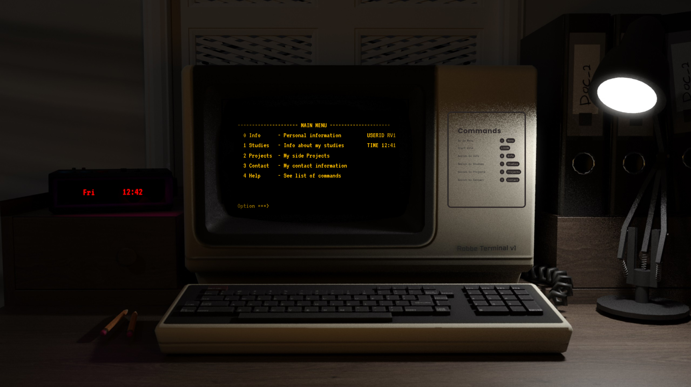

# 🖥️ TN-3270 Inspired Portfolio

Welcome to my personal portfolio website! 🚀 This project is a fully interactive, vintage-style terminal emulator built to resemble the **IBM 3270 mainframe** interface. As a passionate **mainframe student**, I wanted to create something unique that reflects both my love for legacy computing and my technical skills.

## 🎯 About the Project
This portfolio is designed to **mimic a TN-3270 terminal**, giving visitors a nostalgic yet functional experience while exploring my work. The interface is minimalistic, with a black-and-yellow terminal screen where users can type commands to navigate different sections of my site.

## 🌟 Features
- **Mainframe-inspired UI** – Classic 3270-style green-screen terminal interface.
- **Fully interactive** – Users can type commands to navigate sections like About, Projects, Skills, and Contact.
- **No backend** – The site is fully front-end based, ensuring lightweight performance and simple deployment.
- **Authentic experience** – Styled with monospaced fonts and a realistic boot-up sequence.
- **Easter eggs** – Hidden commands and fun interactions for those who explore deeply!

## 🛠️ Technologies Used
- **HTML, CSS, JavaScript** – For structuring and styling the interactive terminal.
- **ASCII Art & CSS animations** – To add that classic green-screen vibe.

## 📸 Screenshot

Background picture : [MaxCorpIndustries](https://www.deviantart.com/maxcorpindustries/art/Vintage-Terminal-1-0-for-rainmeter-831562992)

## 🚀 How to Use
Simply type commands in the terminal prompt:
- `LOGON` – Starts the session
- `Info` – Displays information about me
- `Projects` – Lists my featured projects
- `Studies` – Information about my studies
- `Contact` – Get my social links and email
- `Help` – View available commands
- `x` or `Menu` – To get back to main menu
- `?` – Easter egg

## 📡 Deployment
The site is hosted on Vercel and is optimized for **modern browsers**. No additional setup is required!

## 📬 Contact
If you’d like to connect, feel free to reach out:
- **Email**: [robbe.van.herpe@outlook.com]([mailto:robbe.van.herpe@outlook.com)
- **LinkedIn**: [https://www.linkedin.com/in/robbevanherpe]([https://www.linkedin.com/in/robbevanherpe/)
- **GitHub**: [https://github.com/Robbevanherpe1](https://github.com/Robbevanherpe1)

Enjoy the experience, and happy hacking! 👨‍💻

